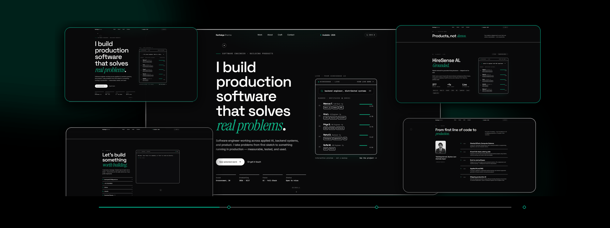
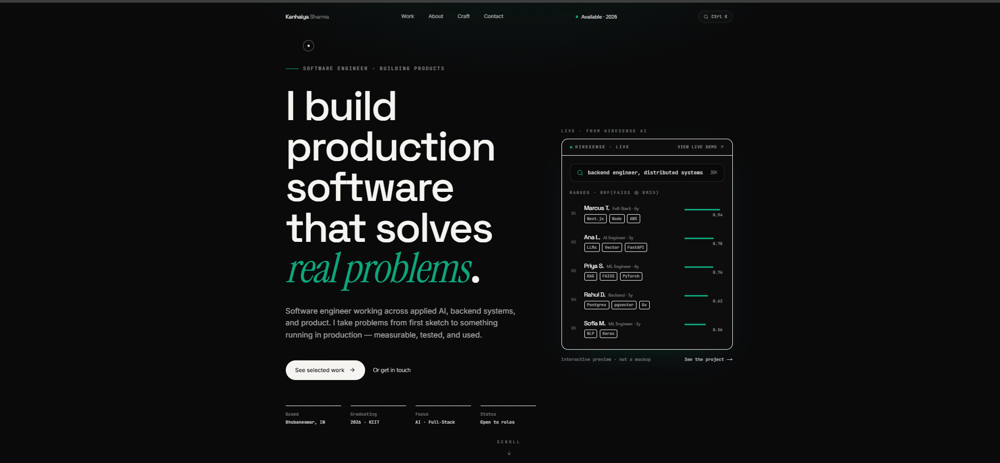
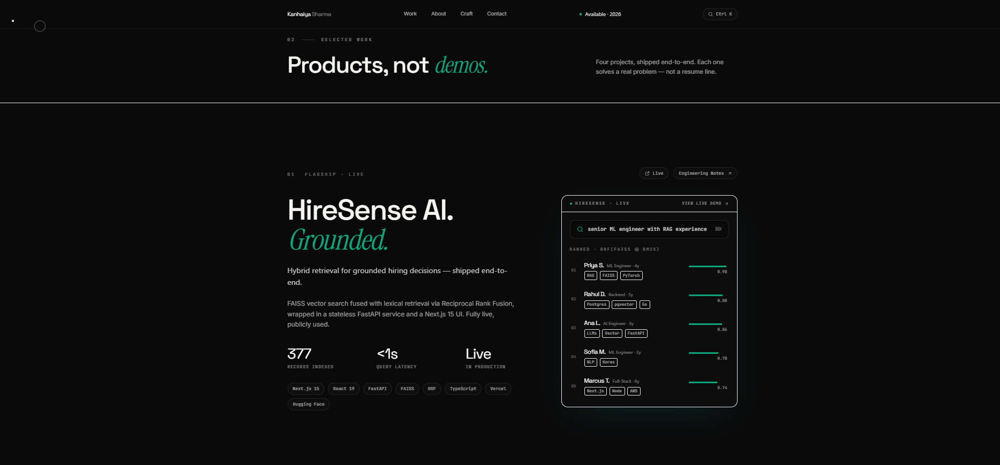
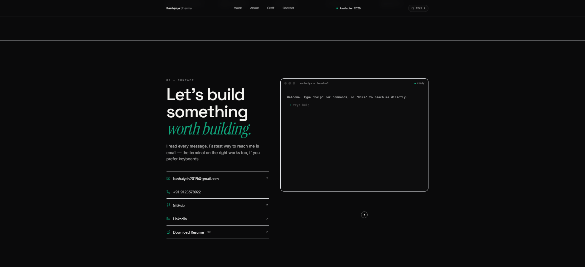

<div align="center">

# Kanhaiya Lal Sharma

### Building software that solves real problems.

Production-ready software engineer focused on Applied AI, Backend Engineering, and Full-Stack Development.

### 🌐 Live Website

## https://kanhaiyasharma.co.in

[Live Portfolio](https://kanhaiyasharma.co.in) •
[HireSense AI](https://hiresense-ai-roan.vercel.app/) •
[LinkedIn](https://www.linkedin.com/in/kanhaiya-lal-sharma-a70a72293) •
[GitHub](https://github.com/kanhaiyas103)

**Next.js • React • Tailwind CSS • Framer Motion • Vercel**

</div>

---


---

# Overview

This portfolio showcases production-ready software projects through interactive case studies instead of traditional project cards.

It highlights engineering decisions, measurable outcomes, live product demonstrations, and clean UI inspired by modern SaaS products.

---

# Screenshots

# Portfolio Preview



## Hero



---

## Projects



---

## Interactive Terminal



---
---

# Highlights

### Interactive Hero

- Live HireSense AI demonstration
- Animated search queries
- Dynamic ranking system
- Real production demo
- Smooth microinteractions

### Engineering Case Studies

- HireSense AI
- Legal Document Intelligence
- NeuroTwin
- LSTM Stock Forecasting

Each project includes:

- Architecture
- Engineering Notes
- Technical Challenges
- Design Decisions
- Performance Metrics
- Future Improvements

### Interactive Terminal

Supports commands including:

```bash
help
resume
github
linkedin
projects
hire
whoami
coffee
cat motivation.txt
sudo hire kanhaiya
clear
```

### Command Palette

Keyboard shortcuts

```
Ctrl + K
⌘ + K
```

Navigate anywhere instantly.

---

# Tech Stack

| Category | Technologies |
|----------|--------------|
| Framework | Next.js 15 |
| Language | JavaScript |
| UI | React 19 |
| Styling | Tailwind CSS |
| Components | shadcn/ui |
| Animations | Framer Motion |
| Icons | Lucide |
| Deployment | Vercel |

---

# Features

- Editorial dark UI
- Fully responsive
- Interactive animations
- Live AI demo
- Command Palette
- Interactive Terminal
- Engineering Notes
- SEO Optimized
- OpenGraph Support
- Dynamic Metadata
- JSON-LD
- Sitemap
- robots.txt
- Accessibility Focused
- Lighthouse Optimized
- Lazy Loading
- Zero Hydration Errors

---

# Performance

- Static Rendering
- Fast Initial Load
- Responsive Design
- Accessibility Optimized
- SEO Friendly
- Production Deployment

---

# Run Locally

```bash
git clone https://github.com/kanhaiyas103/portfolio.git

cd portfolio

npm install

npm run dev
```

Open:

```
http://localhost:3000
```

---

# Project Structure

```
app/
components/
hooks/
lib/
public/
assets/
README.md
```

---

# Deployment

Hosted on **Vercel**.

Every push to the **main** branch automatically deploys the latest production version.

---

# About Me

I'm **Kanhaiya Lal Sharma**, a Computer Science undergraduate at **KIIT University** graduating in **2026**.

I enjoy building production-ready software across:

- Applied AI
- Backend Engineering
- Full-Stack Development
- Product Engineering

My goal is simple:

> Build software that solves real problems.

---

# Connect

🌐 Portfolio

https://kanhaiyasharma.co.in

💼 LinkedIn

https://www.linkedin.com/in/kanhaiya-lal-sharma-a70a72293

💻 GitHub

https://github.com/kanhaiyas103

📧 Email

kanhaiyals2019@gmail.com

---

<div align="center">

### Designed & Engineered by Kanhaiya Lal Sharma

Built with Next.js • React • Tailwind CSS • Framer Motion

© 2026

</div>